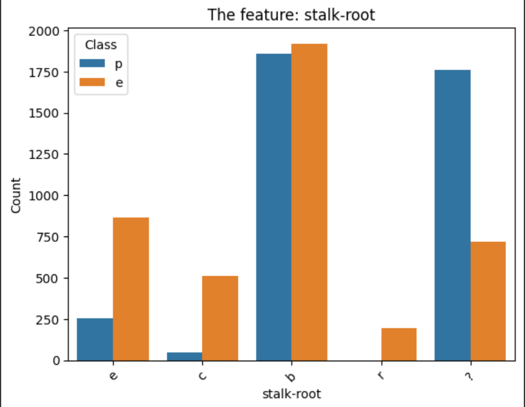
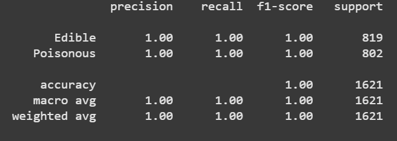

# Mushroom Classification with a Decision Tree

## Overview

This project explores whether a mushroom is edible or poisonous based on its physical features using a decision tree classifier. The data comes from the [Kaggle Mushroom Classification dataset](https://www.kaggle.com/datasets/uciml/mushroom-classification/data), which includes various characteristics like cap shape, gill color, and stalk root type.  

I used a decision tree model because it's easy to interpret and works well with categorical data. With some basic preprocessing, the model ended up achieving perfect accuracy (1.0) on the test set, likely because the dataset is well-structured and the classes are clearly separable.

---

## Dataset Details

- Format: Tabular CSV
- Size: 8124 rows × 23 columns
- Features: All are categorical
- Split:  
  - Training: 4863 samples  
  - Validation: 1621 samples  
  - Test: 1622 samples

---

## Data Cleaning & Preprocessing

- Most of the dataset was already pretty clean.
- One column, `stalk-root`, had some missing values marked as `'?'`. I replaced those with the mode (most common value).
- Dropped columns like `veil-type` and `gill-attachment` since they didn't add much and had very low variance.
- Used one-hot encoding to convert categorical features into numerical format for the model.
*
*
---

## Visualizations

To better understand the data, I plotted frequency distributions for each feature to see how the categories were spread out. This helped me get a sense of which features might be most useful for classification.
*
*
---

## Model & Approach

- **Model Used:** Basic `DecisionTreeClassifier` from `sklearn`
- **Why Decision Tree?** It handles categorical data well and provides easy-to-understand logic.
- I didn’t do any hyperparameter tuning—just used the default settings to keep it simple.
- Trained the model on the processed dataset after encoding.

---

## Conclusions:

The model reached **100% accuracy** on the test set. This isn’t too surprising given the clean nature of the data and how well the classes are separated.

While this result is great, it's worth noting that real-world datasets are rarely this clean or well-structured.
* 
---

## Reproducing Results:

To recreate:
1. Load the dataset from Kaggle.
2. Replace `'?'` values in the `stalk-root` column with the mode.
3. Drop uninformative features.
4. Apply one-hot encoding to the categorical columns.
5. Train a `DecisionTreeClassifier` using `scikit-learn`.

---

## Libraries used/Software

- Python
- pandas as pd
- numpy as np
- seaborn as sns
- matplotlib.pyplot
- scikit-learn
- sklearn.tree, sklearn.model, sklearn.metrics

---

## Repository Files

- `MushroomKaggleChallenge.ipynb`  
- `README.md` – 

---

## Citations/Dataset

- [Kaggle Mushroom Dataset](https://www.kaggle.com/datasets/uciml/mushroom-classification/data)
